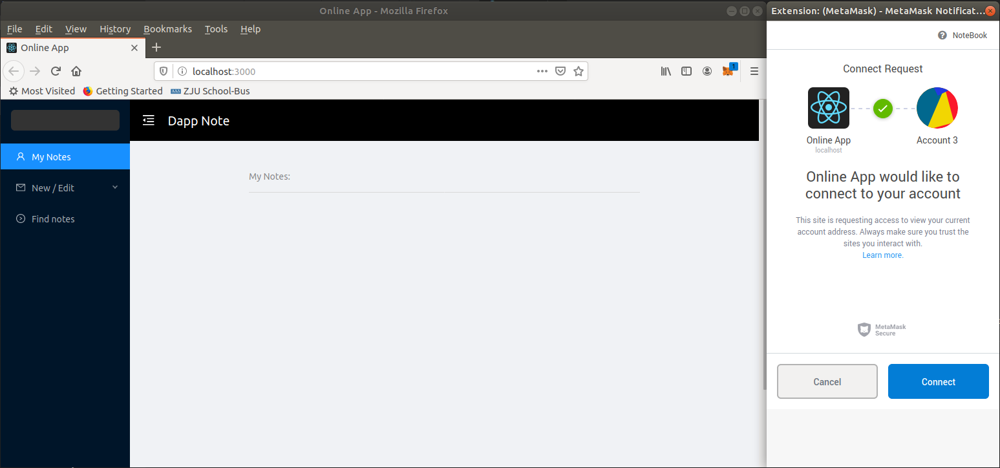
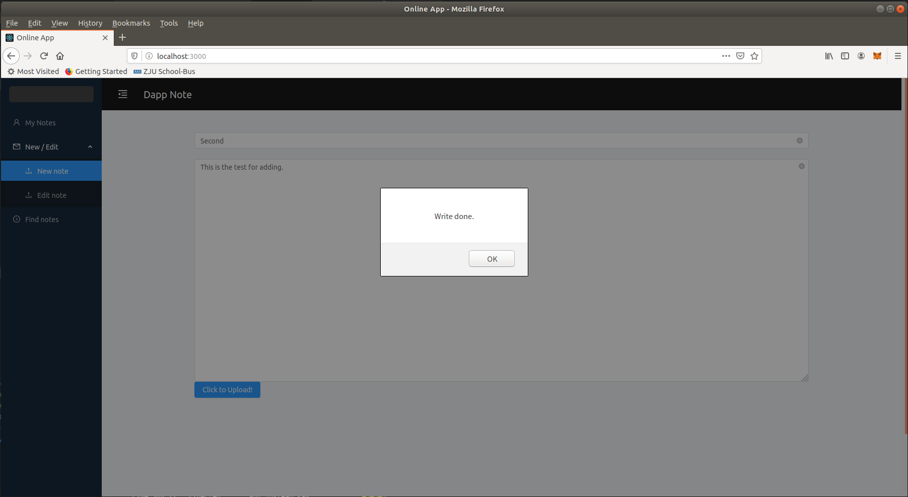
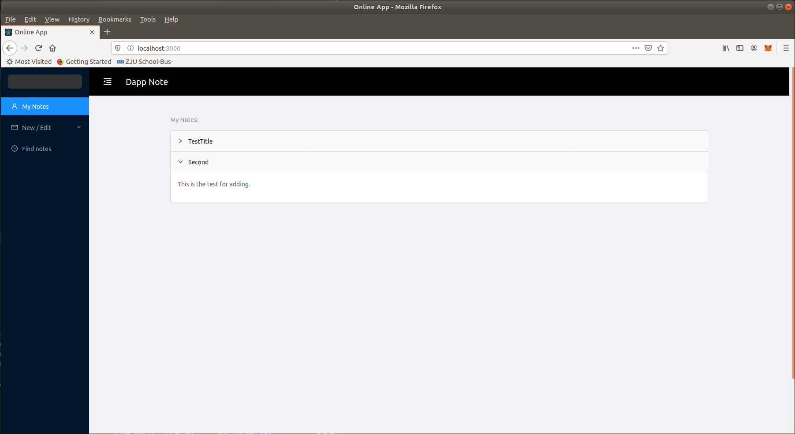
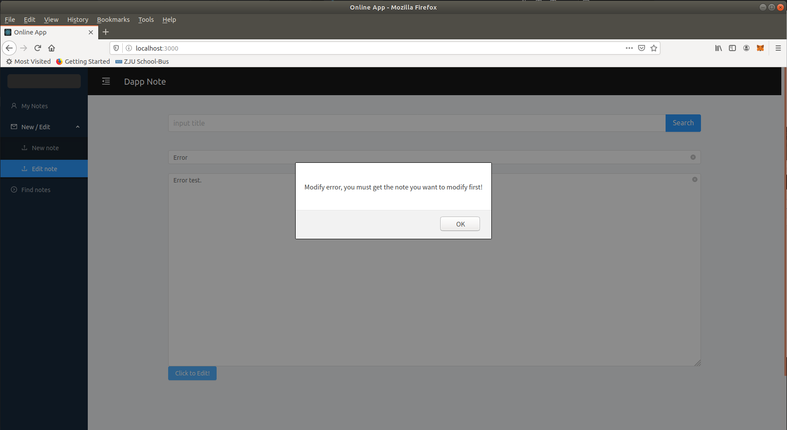
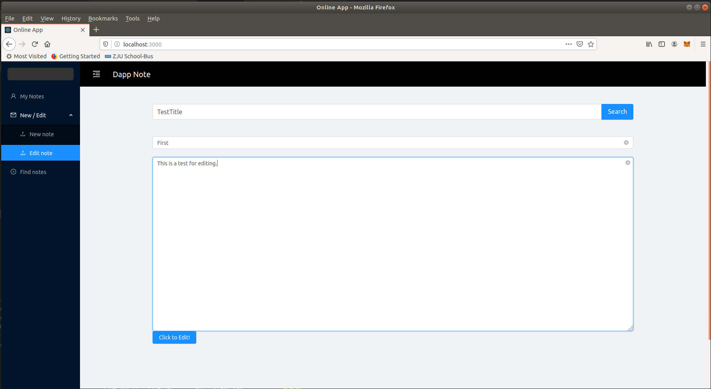
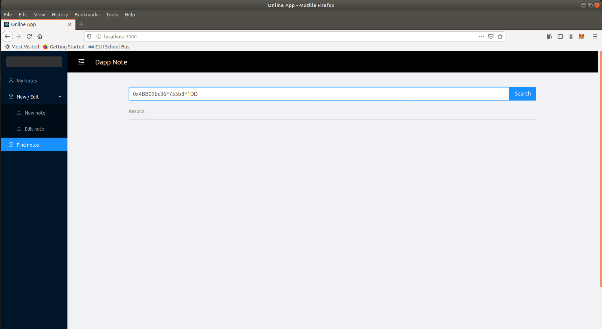

# 项目立意
旨在开发一个基于区块链的链上笔记本系统，在具备传统笔记本的基本功能的基础上，同时具有去中心化的优势，
相对于服务器储存，提高了对数据存储的保证。此外，相对于离线的本地的笔记本，该链上笔记本可以实现所有
用户之间的笔记共享。

# 开发环境
1. 区块链环境：Ganache提供的区块链模拟器
2. 前端设计：采用Javascript库React进行设计
3. 后段设计：采用truffle开发框架进行设计

# 环境搭建
就是基本的基于Ganache的区块链模拟器的开发环境搭建过程，在Ganache中添加一个私有本地网络后，与使用
truffle开发框架进行开发的后端进行绑定，部署项目相关的智能合约。前端就直接与已经部署的合约进行交互
完成相关操作。

# 前端
使用了React框架，antd提供的组件，以及使用Web3调用智能合约。
前端页面提供的功能有
1. 显示使用者账户的笔记信息。   
2. 上传新的笔记
3. 根据笔记的标题修改笔记的标题以及内容
4. 根据被查询者的地址查询其笔记内容

# 后端
采用truffle的开发框架进行设计：
1. 合约采用了储存合约和逻辑合约分离的方式，来实现合约的可升级机制。<br />即对于已经部署了储存合约，
其包含了笔记内容的储存以及一些基本的对内容的读写接口和访问权限的设置，且后续不能再被重新部署或修改，
否则储内容会丢失。而且用户只会与逻辑合约进行交互，而与储存合约进行交互的只能是逻辑合约，再由逻辑合约
与储存合约进行交互，这在储存合约中的权限设置中体现出来。这种设计，使得逻辑合约可以被升级，只需要在重
新部署逻辑合约的时候重新绑定储存合约即可，这在不影响原先储存的同时完成了对合约的升级。
2. 具体的合约设计即储存合约中的内容储存和读取，以及与逻辑合约的绑定方法（权限设置）；逻辑合约则是通过
调用储存合约中的基本方法，在部署的时候进行绑定初始化，以及具体的读，写，修改笔记的操作。实际上考虑逻辑
合约的可升级，由于储存合约的设计中，并不限定只能绑定一个逻辑合约，这也就意味如果需要在原有逻辑上进行添加
逻辑的操作而非只是修改原有逻辑，可以添加新的逻辑合约进行绑定，这两个逻辑合约将同时有效。
3. 对合约的测试包括对储存合约和逻辑合约的测试，涵盖合约中的读写操作方法。测试代码仅编写了后端测试，即
用solidity语言进行测试，测试代码在notebook/test文件下。测试储存合约时是基于合法的访问进行的，即用绑定
的地址进行调用（权限问题），然而实际上在使用未授权的地址进行访问合约的操作时，操作会被拒绝（这里在初期开发
的时候有体现，但是测试代码在整理后删除了）。测试代码通过truffle test操作验证了合约的正确性和安全性。

# 运行截图
- 需要绑定matemask账户

- MyNotes主页界面（之前添加过一条note记录）：

- NewNote界面(已经填写了内容，但是初始界面是空的）：

- NewNote界面（点击提交后）：

- MyNotes主页界面（提交完后自动跳转）：

- EditNote界面(文本框开始都是空的，这里需要先输入note标题搜索要更改note内容，内容会自动出现在文本框中；否则直接修改会报错）：

- EditNote界面（报错）：

- EditNote界面（修改完标题以及内容后，但尚未提交）

- EditNote界面（提交之后）：

- MyNotes界面（Edit结束后自动跳转）：

- FindNote界面（输入搜索地址之前）：

- FindNote界面（输入合法地址之后并点击Serach按钮，若地址尚未有笔记或地址非法则结果均为空）：

- FindNote界面（结果为空）：


# 成员以及贡献占比
- 雷骁(50%) ==> 后端设计和测试以及协助前端设计（由于后端设计较为简单）
- 熊皓(50%) ==> 前端设计

# 具体实现
（即内部实现前后端的内部实现细节,这部分代码都有注释）
## 前端
### 1. 获取当前使用者的账号
``` javascript
componentWillMount() {
        window.addEventListener("load", async () => {
          if (window.ethereum) {
            // console.log("init metamask", window.ethereum);
            web3 = new Web3(window.ethereum);
            await window.ethereum.enable();
            await web3.eth.getAccounts(function(err, accounts) {
            web3.eth.defaultAccount = accounts[0];
            });
          } else {
            console.log("inject sdk");
            web3 = new Web3(
              new Web3.providers.HttpProvider("http://localhost:7545")
            );
            // 添加Ganache第一个账户的私钥
            web3.eth.accounts.wallet.add(
              "0x9d3908699ff0fff75d409fc5bac0ea322cc6287c47299959ee291aef6cfe67a4"
            );
            
            web3.eth.defaultAccount = "0x819De97b7B694941D4F82a9C9B4af544109407F9";
           }
            // Get the number of notes at the very beginning, use the "await" to make sure that read can be successful after get the right length
            await this.GetLength(web3.eth.defaultAccount,1);
            // Read all notes for displaying
            this.Read(web3.eth.defaultAccount,1);
        });
      }
```

首先检测浏览器是否安装了metamask钱包插件，如果安装了，根据metamask的钱包账号，先获得用户授权，再获取当前账户的所有笔记信息，并且显示在首页。如果检测到浏览器没有安装metamask，则会根据代码中提供的账户地址以及私钥来得到其所有的笔记信息，并且显示在首页。
### 2. 显示当前用户的所有笔记信息

首先通过Getlength()函数调用合约的length函数，来获得用户的笔记的数量。然后再调用Read()函数，根据长度，来遍历存储在链上的笔记信息。前端得到笔记的内容之后，会先把笔记的内容存储在notes/other_notes的变量中，如果是使用者本人的笔记存在notes中，如果是查询到的别人的笔记，则存储在ohter_notes中。其结构如下，其中length字段存的是笔记的数量，idx存储的是笔记的下标，用来动态生成组件,iterms中存的是笔记，会根据Read得到的内容进行分割，然后以字典的形式存储。
```javascript
notes = {
        length:0,
        idx:0,
        items:[]
        // The notes' contents
        // Format:
        // {content : "content" , idx: "123", title: "title"}
    }
    
    // For searching others' notes
    other_notes = {
        length:0,
        idx:0,
        items:[]
        // The notes' contents
        // Format:
        // {content : "content" , idx: "123", title: "title"}
    }
```
Getlength函数:
```javascript
GetLength = async (account,my) => {
        // Call the function Length in smart contract
        try{
            const payload = web3.eth.abi.encodeFunctionCall(
                {
                  name: "Length",
                  type: "function",
                  inputs: [{
                      type: 'address',
                      name: '_address'
                  }]
                },
                [account]
            );
    
            const res = await web3.eth.call({
                to: CONTRACT,
                data: payload
            });
            
            // Argument "my" is used to decide change the "length" of the account owner or others
            if(my == 1){
                this.notes["length"] = web3.eth.abi.decodeParameter("uint256", res);
            }
            else{
                this.other_notes["length"] = web3.eth.abi.decodeParameter("uint256", res);
            }
        }
        catch(e)
        {
            // If there is error, same as below
            console.error(e.message);
        }
            
    };
```
链上存储笔记的格式如下：
``` c
title+"\n\n"+content
```
也就是笔记的标题和内容之间存在两个换行符,根据这两个换行符，分离出笔记的内容和标题，然后显示在对应的位置。
Read函数。
其中参数"my"是用来判断是否为调用者本人的账户。
```javascript
Read = async (account,my) => {
        this.setState({
            loading: true
        }); 
        var i=0;
        var length = 0;
        // The function of argument "my" is same as mentioned before
        // Note that has been read before won't be read twice (unless fresh or change the page)
        if(my == 1){
            i = this.notes["idx"]; 
            length = this.notes["length"];
        }
        else{
            i = this.other_notes["idx"]; 
            length = this.other_notes["length"];
        }
        try{
            for(;i<length;i++){
                // Call the function Read in smart contract
                const payload = web3.eth.abi.encodeFunctionCall(
                    {
                      name: "Read",
                      type: "function",
                      inputs: [{
                          type: 'address',
                          name: '_address',
                      },{
                          type: 'uint256',
                          name: 'index',
                      }]
                    },
                    [account,i]
                );
                const res = await web3.eth.call({
                    to: CONTRACT,
                    data: payload
                });
                this.setState({
                    content: web3.eth.abi.decodeParameter("string", res),
                    // idx:i+1
                });  
                // Same as above
                if(my == 1){
                    this.notes["idx"] = i+1; 
                    this.notes["items"].push({'content': this.state.content.substr(this.state.content.indexOf("\n\n")+2),'idx': i.toString(), 'title': this.state.content.substr(0,this.state.content.indexOf("\n\n"))})
                }
                else{
                    this.other_notes["idx"] = i+1; 
                    this.other_notes["items"].push({'content': this.state.content.substr(this.state.content.indexOf("\n\n")+2),'idx': i.toString(), 'title': this.state.content.substr(0,this.state.content.indexOf("\n\n"))})
                }
                // Update the page after read successfully
                this.changeShowState2true();
            }                  
        }
        catch(e)
        {
            console.error(e.message);
        }
        finally
        {
            this.setState({
                loading: false
            }); 
        }
           
    };
```
动态生成笔记的组件，使用map动态得到多个组件
```javascript
<Breadcrumb style={{ margin: '20px 0' }}>
    <div id="shownotes" style={{display:'block'}}>
    <p id = "my_navigation">My Notes:</p>
    <Collapse accordion >
            {this.notes["items"].map((note) => {
            return (
                <Panel header={note.title} key={note.idx}>
                    <p>{note.content}</p>
                </Panel>
            )
            })}
    </Collapse>
    </div>
</Breadcrumb>       
```
### 3. 上传新的笔记

这个界面会有两个输入框，分别对应笔记的title以及content，当点击提交按钮的时候，会得到输入的title以及输入的content。然后将其合成如下格式
```c
title+"\n\n"+content
```
之后就是调用通过WriteNote()来调用合约上的Write()函数，写入笔记。
代码如下：
```javascript
//获取输入内容
<div id = "upload_div" style={{display:'none'}}>
        <Input  id = "input_title" placeholder="input with title " allowClear onChange={onChange} required/>
        <br />
        <br />
        <TextArea id = "input_content" rows="20" cols="20" placeholder="textarea with clear icon" allowClear onChange={onChange} />
        <Button  type="primary"  onClick={() => {this.Func_doUpload(document.getElementById("input_title").value,document.getElementById("input_content").value)}} >
            Click to Upload!
        </Button>
</div>
//合成笔记内容和标题，调用Writenote()
Func_doUpload = async (title,content) => {
     var tmp;
     tmp = title+"\n\n"+content;
     await this.WriteNote(tmp);
     window.location.reload(true); 
 };
//调用合约上的Write函数，写入笔记
WriteNote = async (content) => {
     // Call the function Write in smart contract
     const funcSig = web3.eth.abi.encodeFunctionSignature("Write(address,string)");
     const param = web3.eth.abi.encodeParameters(['address','string'],[web3.eth.defaultAccount,content]);
     try {
         await web3.eth.sendTransaction({
           to: CONTRACT, 
           data: funcSig + param.slice(2),
           gas: 2000000
         });
         alert("Write done.");
       } catch (e) {
         console.error(e.message);
       } finally {
         // Update the length in state after writing down (maybe fail, thus length won't change)
         this.GetLength(web3.eth.defaultAccount,this.notes); 
       }  
 };
```

### 4. 修改笔记
这里会要求先输入文章标题，点击Search按钮，会得到文章内容。如果没有找到，就会弹出提示"Not Found"。如果找到，那么就把内容填入内容修改框，标题填入标题修改框，方便修改。当没有找到笔记对应下标的时候，是无法完成修改的。完成之后会刷新页面，回到展示所有笔记的页面。代码如下：
```javascript
//前端代码
<div id = "edit_div" style={{display:'none'}}>
    <div >
            <Search
                id = "search_accord_title"
                placeholder="input title"
                enterButton="Search"
                size="large"
                onSearch={value => this.Func_doSearch(value)}
            />
    </div>
    <br />
    <br />
    <Input  id = "edit_title" placeholder="Your original title will be put here " allowClear onChange={onChange}/>
    <br />
    <br />
    <TextArea id = "edit_content" rows="20" cols="20" placeholder="Your original content will be put here" allowClear onChange={onChange} />
    <Button  type="primary" loading={this.state.loading} onClick={() => {this.Func_doEdit(document.getElementById("edit_title").value,document.getElementById("edit_content").value)}}>
        Click to Edit!
    </Button>
</div>
//搜索并自动填入标题和内容
Func_doSearch = (title) => {
   var i=0;
   var content, title;
   var find = 0;
   for(i=0;i<this.notes["length"];++i){
      if(this.notes["items"][i]["title"] === title){
          content = this.notes["items"][i]["content"];
          title = this.notes["items"][i]["title"];
          document.getElementById("edit_content").value = content;
          document.getElementById("edit_title").value = title;
          this.edit_idx = i;
          find = 1;
          break;
      }
   }
   if(find == 0)
   {
      alert("Not found");
   }
};
//如果找到，那么通过ModifyNote()调用合约中的Modify函数，完成之后将下标初始化，
//并且刷新页面，回到最开始的展示所有笔记的页面
Func_doEdit = async (title, content) => {
     if(this.edit_idx == -1)
     {
         alert("Modify error, you must get the note you want to modify first!");
         return;
     }
     var tmp;
     tmp = title+"\n\n"+content;
     await this.ModifyNote(tmp);
     this.edit_idx = -1;
     window.location.reload(true); 
 }
//传入地址，下标以及标题和内容合成的content
ModifyNote = async (content) => {
     // Call the funcion Modify in smart contract
     const funcSig = web3.eth.abi.encodeFunctionSignature("Modify(address,uint256,string)");
     const param = web3.eth.abi.encodeParameters(['address','uint256','string'],[web3.eth.defaultAccount,this.edit_idx,content]);
     try {
         await web3.eth.sendTransaction({
           to: CONTRACT, 
           data: funcSig + param.slice(2),
           gas: 2000000
         });
         alert("Modify done.");
       } catch (e) {
         console.error(e.message);
       } finally {
         // Update the length
         this.GetLength(web3.eth.defaultAccount,this.notes); 
       }  
 }
```
### 5.查询别人的笔记
根据输入的被查询的地址，调用Getlength()以及Read()函数，笔记的相关信息均存储在other_note结构体变量中，过程与查询自己的笔记内容一致。如果没有查到，那么就会输出Not Found的提示框。如果查到了，那么就会在当前搜索框下面显示别人的笔记信息。
代码如下：
```javascript
//搜索框的实现
<div id = "search_input" style={{display:'none'}}>
        <Search
            id = "search_content"
            placeholder="input search address"
            enterButton="Search"
            size="large"
            onSearch={value => this.Func_SearchOtherNote(value)}
        />
</div>
//查询其他笔记的函数
Func_SearchOtherNote = async (account) => {
     try {
         this.EmptyOtherNotes();
         await this.GetLength(account,0);
         this.Read(account,0);
         this.displayAndHiddenBtn("shownotes","h");
         this.displayAndHiddenBtn("upload_div","h");
         this.displayAndHiddenBtn("search_input","d");
         this.displayAndHiddenBtn("show_other_notes","d");
         this.displayAndHiddenBtn("edit_div", "h");
         document.getElementById("other_navigation").innerText = "Results:";
       } catch (e) {
         console.error(e.message);
         alert("Not found");
       } finally {
         this.setState({
           loading: false
         });
       }
 }
//前端显示笔记的实现
<Breadcrumb style={{ margin: '20px 0' }} id="show_other_notes" style={{display:'none'}}>
   <div >
     <br />
     <p id = "other_navigation"></p>
   <Collapse accordion >
         {this.other_notes["items"].map((other_note) => {
         return (
             <Panel header={other_note.title} key={other_note.idx}>
                 <p>{other_note.content}</p>
             </Panel>
         )
         })}
     </Collapse>
   </div>
</Breadcrumb>  
```

## 后端设计
### 1. 储存合约 <b>NoteStorage.sol</b>
储存笔记，以及权限记录
```solidity
// Owner of the notes
mapping(address => string[]) public Notes;
// Access control
mapping(address => bool) AccessRight;
```
构造函数，用于绑定逻辑合约
```solidity
// Only the logic layer can access the NoteStorage directly
constructor() public
{
    AccessRight[msg.sender] = true;
}
```
权限管理，读笔记，写笔记，获取笔记长度功能
```solidity
// Allow a logic layer to access (for updating the logic layer)
function AllowAccess(address _address) public platform
{
    AccessRight[_address] = true;
}

// Deny a old logic layer to access (for delete the unused logic)
function DenyAccess(address _address) public platform
{
    AccessRight[_address] = false;
}

// Get a note from specific index
function GetNote(address _address, uint256 index) public view returns(string memory)
{
    return Notes[_address][index];
}

// Set a note for specific index (maybe add or edit)
function SetNote(address _address, uint256 index, string memory note) public platform
{
    if(index >= Notes[_address].length)
    {
        Notes[_address].push(note);
        //Views[_address].push(0);
    }
    else
    {
        Notes[_address][index] = note;
    }
}

// The number of notes
function GetLength(address _address) public view returns(uint256)
{
    return Notes[_address].length;
}
```
### 2. 逻辑合约 <b>NoteLogic.sol</b>
储存合约的实例，用于和储存合约的交互
```solidity
NoteStorage noteStorage;
```
构造函数，用于部署时绑定储存合约
```solidity
// Access the storage layer
constructor(address noteStorageAddress) public
{
    noteStorage = NoteStorage(noteStorageAddress);
}
```
读笔记，修改笔记，写笔记，获取长度功能
```solidity
// Write a note
function Write(address _address, string memory note) public owner(_address)
{
    uint256 length = noteStorage.GetLength(_address);
    noteStorage.SetNote(_address, length, note);
}

// Read a note
function Read(address _address, uint256 index) public view returns (string memory)
{
    uint256 length = noteStorage.GetLength(_address);
    require(index < length, "Out of range");

    return noteStorage.GetNote(_address, index);
}

// Edit a note
function Modify(address _address, uint256 index, string memory note) public owner(_address)
{
    uint256 length = noteStorage.GetLength(_address);
    require(index < length, "Out of range");

    noteStorage.SetNote(_address, index, note);
}

// Get the number of notes in total
function Length(address _address) public view returns (uint256)
{
    return noteStorage.GetLength(_address);
}
```
### 3. 合约测试
<b>TestNoteStorage.sol</b>
```solidity
pragma solidity >= 0.4.21 < 0.7.0;

import "truffle/Assert.sol";
import "truffle/DeployedAddresses.sol";
import "../contracts/NoteStorage.sol";

contract TestNoteStorage
{
    address testAddress = address(this);
    NoteStorage noteStorage = new NoteStorage();

    function testNoteStorageGetLength() public
    {
        string memory testAddString = "Hello, this is the first note.";
        uint256 length;

        length = noteStorage.GetLength(testAddress);
        Assert.equal(length, 0, "Length initialize error!");

        noteStorage.SetNote(testAddress, 0, testAddString);

        length = noteStorage.GetLength(testAddress);
        Assert.equal(length, 1, "Length update error!");
    }
    /*
    function testNoteStorageViews() public
    {
        string memory testAddString = "Hello, this is the first note.";
        string memory testGetString;
        uint256 views1;
        uint256 views2;

        noteStorage.SetNote(testAddress, 0, testAddString);
        views1 = noteStorage.GetView(testAddress, 0);

        testGetString = noteStorage.GetNote(testAddress, 0);
        views2 = noteStorage.GetView(testAddress, 0);

        Assert.equal(views1, 0, "Views initialize error!");
        Assert.equal(views2, 1, "Views update error!");
    }
    */
    function testNoteStorageSetAndGetNote() public
    {
        string memory testAddString = "Hello, this is the first note.";
        string memory testGetString;

        noteStorage.SetNote(testAddress, 0, testAddString);
        testGetString = noteStorage.GetNote(testAddress, 0);

        Assert.equal(testAddString, testGetString, "Add or get note error!");
    }
}
```
<b>TestNoteLogic.sol</b>
```solidity
pragma solidity >= 0.4.21 < 0.7.0;

import "truffle/Assert.sol";
import "truffle/DeployedAddresses.sol";
import "../contracts/NoteLogic.sol";
import "../contracts/NoteStorage.sol";

contract TestNoteLogic
{
    address testAddress = address(this);
    NoteStorage noteStorage = new NoteStorage();
    address testNoteStorageAddress = address(noteStorage);
    NoteLogic noteLogic = new NoteLogic(testNoteStorageAddress);

    constructor() public
    {
        noteStorage.AllowAccess(address(noteLogic));
    }

    function testNoteLogicLength() public
    {
        string memory testAddString = "Hello, this is the first note.";
        uint256 length;

        length = noteLogic.Length(testAddress);
        Assert.equal(length, 0, "Length error");

        noteLogic.Write(testAddress, testAddString);

        length = noteLogic.Length(testAddress);
        Assert.equal(length, 1, "Length error");
    }
    /*
    function testNoteLogicView() public
    {
        string memory testAddString = "Hello, this is the first note.";
        string memory testGetString;
        uint256 view1;
        uint256 view2;

        noteLogic.Write(testAddress, testAddString);
        view1 = noteLogic.Views(testAddress, 0);

        testGetString = noteLogic.Read(testAddress, 0);
        view2 = noteLogic.Views(testAddress, 0);

        Assert.equal(view1, 0, "Views initialize error!");
        Assert.equal(view2, 1, "Views update error!");
    }
    */
    function testNoteLogicWriteAndRead() public
    {
        string memory testAddString = "Hello, this is the first note.";
        string memory testAddString2 = "Hello, this is the second note.";
        string memory testGetString;
        string memory testGetString2;

        noteLogic.Write(testAddress, testAddString);
        noteLogic.Write(testAddress, testAddString2);

        testGetString = noteLogic.Read(testAddress, 0);
        testGetString2 = noteLogic.Read(testAddress, 0);

        Assert.equal(testGetString, testAddString, "Write or read note error!");
        Assert.equal(testGetString2, testAddString, "Write or read note error!");
    }

    function testNoteLogicModify() public
    {
        string memory testAddString = "Hello, this is the first note.";
        string memory testModString = "Hello, this is the second note.";
        string memory testGetString;

        noteLogic.Write(testAddress, testAddString);
        noteLogic.Modify(testAddress, 0, testModString);
        testGetString = noteLogic.Read(testAddress, 0);

        Assert.equal(testModString, testGetString, "Modify note error!");
    }
```


